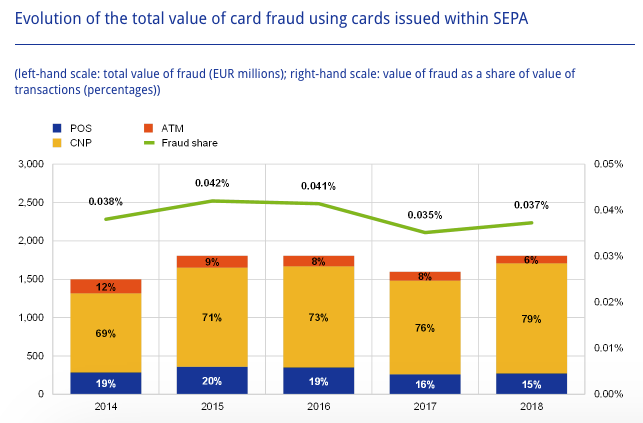
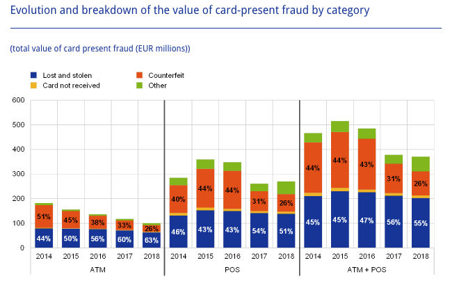

(Credit_Card_Fraud_Scenarios)=
# Credit card fraud scenarios

Worldwide financial losses caused by credit card fraudulent activities are worth tens of billions of dollars. One American over ten has been a victim of credit card fraud (median amount of $399), according to the Statistic Brain Research Institute {cite}`StatisticBrain2018`. According to the latest European Central Bank (ECB) report {cite}`ECB2020`, the total level of card fraud losses amounted to €1.8 billion in 2018 in the Single European Payment Area (SEPA).

There exists a wide variety of scenarios that may lead a fraudster to successfully perform fraudulent payments with a credit card. There is currently no definite taxonomy on credit card fraud types, though certain patterns are known to occur more frequently than others. It should also be noted that fraud detection is a cat and mouse game, where fraudulent patterns change over time. As technology evolves, both in terms of fraud prevention and ease of use of payment systems, so do fraudster techniques. They adapt by moving from the old (and by now fixed) targets to the vulnerability of the new technologies. They also benefit from the constant changes in volume and characteristics of genuine transactions.

## Card-present vs Card-not-present frauds

It is useful to distinguish two transaction scenarios. The first, called *card-present* (CP) scenarios, refer to scenarios where a physical card is needed, such as transactions at a store (also referred to as a point-of-sale - POS) or transactions at a cashpoint (for instance at an automated teller machine - ATM). The second, called *card-not-present* (CNP) scenarios, refers to scenarios where a physical card does not need to be used, which encompasses payments performed on the Internet, by phone, or by mail. 

This distinction is important since the techniques used to compromise a card vary, depending on whether a physical copy of the card needs to be produced or not. More importantly, fraudsters are recently more likely to exploit the deficiencies of CNP scenarios than CP ones, probably because CP scenarios have existed for more than two decades now, and have become pretty robust to fraud attacks, notably thanks to the EMV technology (Europay Mastercard and Visa, i.e. chip-embedded cards). Another reason is that simple considerations on physical barriers can often help to prevent CP frauds. As stated in the 2019 Nilson report, CNP scenarios accounted for 54% of all losses to fraud for the year 2018, while only accounting for less than 15% of all purchase volume worldwide (CNP+POS+ATM) {cite}`NilsonReport2019`. The proportion of CNP fraud is even higher in Europe and was reported to account for 79% of all transactions from cards issued within SEPA in the 2020 report on card fraud of the European Central Bank {cite}`ECB2020`, as reported in the figure below. 

Fig. 1. Evolution of total value of card fraud using cards issued within SEPA.  Card-not-present frauds account for the majority of reported frauds.

### Card-present frauds

Card-present frauds occur when a fraudster manages to make a successful fraudulent transaction using a physical payment card, either at an ATM or a POS. In this setting, fraud scenarios are usually categorized as *lost or stolen cards*, *counterfeited cards*, and *card not received*.

**Lost or stolen card**: The card belongs to a legitimate customer, and gets in the hands of a fraudster after a loss or a theft. This is the most common type of fraud in the card-present fraud setting and allows a fraudster to make transactions as long as the card is not blocked by its legitimate owner. In this scenario, the fraudster usually tries to spend as much as possible and as quickly as possible.

**Counterfeited card**: A fake card is produced by a fraudster, by imprinting the information of a card. Such information is usually obtained by *skimming* the card of the legitimate customer, without them noticing. Since the legitimate owners are not aware of the existence of a copy of their card, the source of the fraud might be more difficult to identify, since the fraudster can wait a long time before making use of the fake card. The increased use of chip-and-PIN (aka EMV) technology has reduced this type of fraud. 

**Card not received**: The card was intercepted by a fraudster in the mailbox of a legitimate customer. This may happen if a customer orders a new card, which gets intercepted, or if a fraudster manages to order a new card without the knowledge of the legitimate customer (for example by accessing fraudulently their bank account), and have it delivered to a different address. In the former case, the customers may quickly warn the bank that their card was not received, and have it blocked. The latter case can be harder to detect since the customer is not aware that a new card was ordered. 

Statistics on the proportion of these fraud types in card-present scenarios were reported by the European Central Bank for 2018, see the chart below {cite}`ECB2020`.

Fig. 2. Evolution and breakdown of the value of card-present fraud by category within SEPA.

The main categories of frauds are *lost and stolen*, and *counterfeited cards*, whereas *card not received* scenarios account for a very small proportion of fraud losses. It is worth noting that these fraud proportions are around the same whether payments were made at an ATM or a POS, and that overall, the amount of frauds in card-present settings tends to decrease.

### Card-not-present frauds

Card-not-present refers to the general category of frauds conducted remotely, either by mail, phone, or on the Internet, using only some of the information present on a card. 

Overall, there are fewer statistics available on the cause of such frauds. For example, contrary to card-present frauds, the European Central Bank only requires the card payment scheme operators to report the overall CNP fraud losses.

It is however known that most CNP frauds are a direct consequence of illegally obtained payment credentials (e.g., card numbers), either from data breaches or sometimes directly from the cardholders (e.g. via phishing, scam text messages). Also worth noting, such credentials are usually not used directly, but rather put on sale on underground web marketplaces (the *dark web*), and later used by criminal groups. Criminals who steal data are usually a different group than criminals who perpetrate frauds {cite}`ECB2020,NilsonReport2019`. 

The data that is generally involved in card-not-present fraud involves the card number, card expiration date, card security code, and personal billing information (such as the cardholder’s address).

