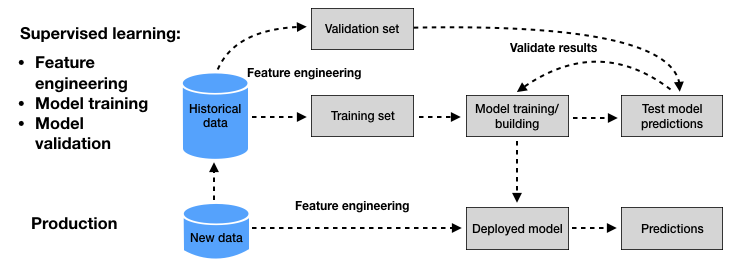
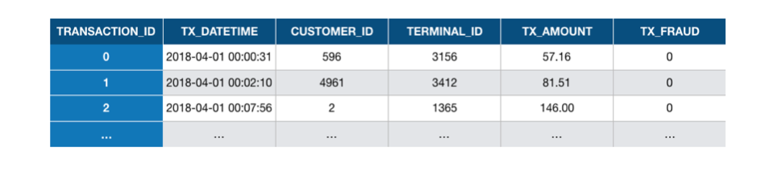
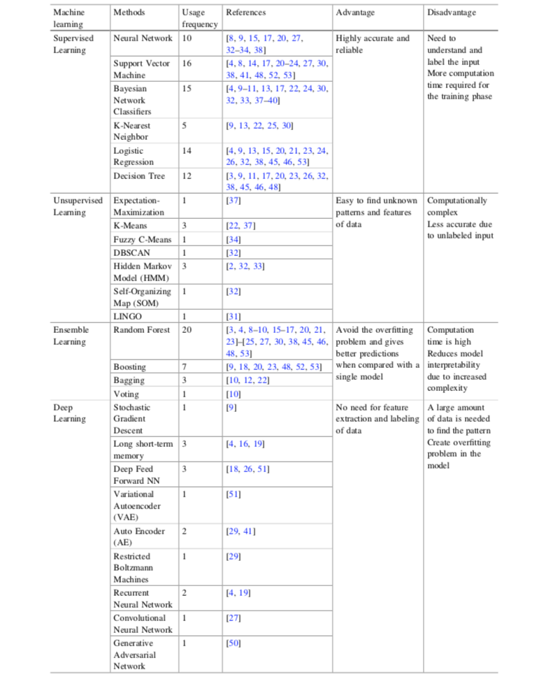

(ML_For_CCFD)=
# Machine learning for credit card fraud detection

Credit card fraud detection (CCFD) is like looking for needles in a haystack. It requires finding, out of millions of daily transactions, which ones are fraudulent. Due to the ever-increasing amount of data, it is now almost impossible for a human specialist to detect meaningful patterns from transaction data. For this reason, the use of machine learning techniques is now widespread in the field of fraud detection, where information extraction from large datasets is required {cite}`lucas2020credit,priscilla2019credit,carcillo2018beyond,dal2015adaptive`.

Machine Learning (ML) is the study of algorithms that improve automatically through experience {cite}`bontempi2021statistical,friedman2001elements`. ML is closely related to the fields of Statistics, Pattern Recognition, and Data Mining. At the same time, it emerges as a subfield of computer science and artificial intelligence and gives special attention to the algorithmic part of the knowledge extraction process. ML plays a key role in many scientific disciplines and its applications are part of our daily life. It is used for example to filter spam email, for weather prediction, in medical diagnosis, product recommendation, face detection, fraud detection, etc {cite}`dal2015adaptive,bishop2006pattern`.

The ability of ML techniques to effectively address the challenges raised by CCFD has led to a large and growing body of research in the last decade. As reported in Fig. 1, thousands of papers related to this topic have been published between 2010 and 2020, with about 1500 papers published in 2020 alone. 


<p style="text-align: center;">
Fig. 1. Number of published articles on the topic of machine learning and credit card fraud detection between 2010 and 2020. Source: Google Scholar.
</p>

This section aims at providing an overview of this body of recent research, by summarising the main research challenges, and the key machine learning concepts that can be used to address them.   


## Recent surveys

To get a picture of the current state of research on ML for CCFD, we searched Google Scholar for all reviews and surveys made on this topic in the last five years. Using the following boolean search: `("machine learning" OR "data mining") AND "credit card" AND "fraud detection" AND (review OR survey)` and restricting the search period from 2015 to 2021, we identified ten reviews/surveys which we report in the following table. 


| Title | Date| Reference |
|---|---|---|
|A survey of credit card fraud detection techniques: <br> Data and technique oriented perspective | 2016 | {cite}`zojaji2016survey`|
|A survey of machine-learning and nature-inspired <br> based credit card fraud detection techniques | 2017 | {cite}`adewumi2017survey`|
|A survey on credit card fraud detection <br> using machine learning | 2018 | {cite}`popat2018survey`|
|A state-of-the-art review of machine learning techniques <br> for fraud detection research | 2018 | {cite}`sinayobye2018state`|
|Detection of credit card fraud: State of art | 2018 | {cite}`sadgali2018detection`|
|A survey on different data mining \& machine learning methods <br> for credit card fraud detection | 2018 | {cite}`patil2018survey`|
|A systematic review of data mining approaches <br> to credit card fraud detection | 2018 | {cite}`mekterovic2018systematic`|
|A Comprehensive Survey on Machine Learning Techniques <br> and User Authentication Approaches <br>for Credit Card Fraud Detection | 2019 | {cite}`yousefi2019comprehensive`|
|Credit Card Fraud Detection: A Systematic Review | 2019 | {cite}`priscilla2019credit`|
|Credit card fraud detection using machine learning: <br> A survey | 2020 | {cite}`lucas2020credit`|

A set of ten surveys in five years can be considered high. The fact that so many surveys were published in such a short period (in particular for the five surveys published in 2018) reflects the rapid evolution of the topic of ML for CCFD and the need that teams of independent researchers felt in synthesizing the state of research in this field. 

Given the common goal of these surveys, it is worth noting that a high degree of redundancy can be found in terms of content. In particular, they all emphasize a common set of methodologies and challenges, that we present in the next two sections. We first cover the baseline methodology, that is, the common workflow that is typically followed in papers dealing with the use of ML techniques to address CCFD. We then summarize the challenges that characterize this topic. 

(ML_For_CCFD_Baseline_Methodology)=
## Baseline methodology - Supervised learning

A wide number of ML techniques can be used to address the problem of CCFD. This is directly reflected by the huge amount of published papers on the topic in the last decade. Despite this large volume of research work, most of the proposed approaches follow a common baseline ML methodology {cite}`patil2018survey,friedman2001elements,bishop2006pattern`, which we summarize in Fig. 2.


<p style="text-align: center;">
Fig. 2. ML for CCFD: Baseline methodology followed by most of the proposed approaches in the recent surveys on the topic.  
</p>

In credit card fraud detection, data typically consists of transaction data, collected for example by a payment processor or a bank. Transaction data can be divided into three groups {cite}`lucas2020credit,adewumi2017survey,VANVLASSELAER201538`

* Account-related features: They include for example the account number, the date of the account opening, the card limit, the card expiry date, etc.
* Transaction-related features: They include for example the transaction reference number, the account number, the transaction amount, the terminal (i.e., POS) number, the transaction time, etc. From the terminal, one can also obtain an additional category of information: merchant-related features such as its category code (restaurant, supermarket, ...) or its location.
* Customer-related features: They include for example the customer number, the type of customer (low profile, high profile, ...), etc.

In its simplest form, a payment card transaction consists of any amount paid to a merchant by a customer at a certain time. A set of historical transaction data may be represented as a table such as illustrated in Fig. 3. For fraud detection, it is also generally assumed that the legitimacy of all transactions is known (that is, whether the transaction was genuine or fraudulent). This is usually represented by a binary label, with a value of 0 for a genuine transaction, and a value of 1 for fraudulent transactions. 


<p style="text-align: center;">
Fig. 3. Example of transaction data represented as a table. Each row corresponds to a transaction from a customer to a terminal. The last variable is the label, which indicates whether the transaction was genuine (0) or fraudulent (1).   
</p>

Two stages can be distinguished in the design of an ML-based fraud detection system. The first stage consists of building a prediction model from a set of labeled historical data (Fig. 2, upper part). This process is called *supervised learning* since the label of the transactions (genuine or fraudulent) is known. In the second stage, the prediction model obtained from the supervised learning process is used to predict the label of new transactions (Fig. 2, lower part). 

Formally, a prediction model is a parametric function with parameters $\theta$, also called a *hypothesis*, that takes an input $x$ from an input domain $\mathcal{X}\subset \mathbb{R}^n$, and outputs a prediction $\hat{y}=h(x,\theta)$ over an output domain $\mathcal{Y} \subset \mathbb{R}$ {cite}`carcillo2018beyond,dal2015adaptive`:

$$
h(x,\theta): \mathcal{X} \rightarrow \mathcal{Y}
$$
  
The input domain $\mathcal{X}$ usually differs from the space of raw transaction data for two reasons. First, for mathematical reasons, most supervised learning algorithms require the input domain to be real-valued, that is, $\mathcal{X} \subset \mathbb{R}^n$, which requires to transform transaction features that are not real numbers (such as timestamps, categorical variables, etc...). Second, it is usually beneficial to enrich transaction data with other variables that may improve the detection performance of the prediction model. This process is referred to as *feature engineering* (also known as *feature transformation*, *feature extraction*, or *data preprocessing*).

For fraud detection, the output domain $\mathcal{Y}$ is usually the predicted class for a given input $x$, that is $\mathcal{Y}=\{0,1\}$. Given that the output class is binary, these prediction models are also called *binary classifiers*. Alternatively, the output may also be expressed as a fraud probability, with $\mathcal{Y}=[0,1]$, or more generally as a risk score, with $\mathcal{Y} = \mathbb{R}$, where higher values express higher risks of fraud. 

The training (or building) of a prediction model $h(x,\theta)$ consists of finding the parameters $\theta$ that provide the best performance. The performance of a prediction model is assessed using a loss function, that compares the true label $y$ to the predicted label $\hat{y}=h(x,\theta)$ for an input $x$. In binary classification problems, a common loss function is the zero/one loss function $L_{0/1}$, which assigns a loss equal to one in the case of wrong prediction, and zero otherwise:

$$
\begin{align}
L_{0/1}: \mathcal{Y} \times \mathcal{Y} &\rightarrow& \{0,1\} \\
y,\hat{y} &= & 
\begin{cases}
    1,& \text{if } y \ne \hat{y}\\
    0,& \text{if } y=\hat{y}
\end{cases}
\end{align}
$$

```{note}
The zero/one loss function is a standard loss function for binary classification problems. It is however not well suited for credit card fraud detection problems, due to the high-class imbalance (much more genuine than fraudulent transactions). Estimating the performance of a fraud detection system is a non-trivial issue, which will be covered in depth in [Chapter 4[(Performance_Metrics).
```

To obtain a fair estimate of a prediction model performance, an important methodological practice, known as *validation*, is to evaluate the performance of a prediction model on data that were not used for training. This is achieved by splitting the dataset, before training, into a *training set* and a *validation set*.  The training set is used for the training of the prediction model (that is, to find the parameters $\theta$ that minimize the loss on the training set). Once the parameters $\theta$ have been fixed, the loss is estimated with the validation set, which gives a better estimate of the performance that the prediction model is expected to have on future (and unseen) transactions. 


```{note}
Particular care must be taken in practice when splitting the dataset into training and validation sets, due to the sequential nature of credit card transactions, and the delay in fraud reporting. These issues will be addressed in detail in [Chapter 5](Model_Validation_And_Selection).    
```

The supervised learning procedure typically consists of training a set of prediction models and estimating their performances using the validation set. At the end of the procedure, the model that is assumed to provide the best performance (that is, the lowest loss on the validation set) is selected, and used for providing predictions on new transactions (See Fig. 2).

A wide range of methods exists for designing and training prediction models. This partly explains the large research literature on ML for CCFD, where papers usually focus on one or a couple of prediction methods. The survey from Priscilla et al. in 2019 {cite}`priscilla2019credit` provides a good overview of the machine learning methods that have been considered for the problem of CCFD. Their survey covered close to one hundred research papers, identifying for each paper which ML techniques were used, see Fig. 4.  


<p style="text-align: center;">
Fig. 4. Usage frequency of ML techniques in CCFD. Source: Priscilla et al., 2019 {cite}`priscilla2019credit`. References given in the table are in {cite}`priscilla2019credit`. 
</p>

The classification of learning techniques into 'high-level' categories is not a simple exercise since there often exists methodological, algorithmic, or historical connections among them. Priscilla et al. chose to divide approaches into four groups: Supervised learning, unsupervised learning, ensemble learning, and deep learning. It could be argued that ensemble learning and deep learning are part of supervised learning since they require labels to be known. Also, deep learning and neural networks can be considered to be part of the same category.  

Covering all ML techniques is out of scope for this book. Rather, our goal is to provide a reference and reproducible framework for CCFD. We decided, based on our research works, to cover five types of methods: logistic regression (LR), decision trees (DT), Random forests (RF), Boosting, and Neural networks/Deep learning (NN/DL). LR and DT were chosen due to their simplicity and interpretability. RF and Boosting were chosen since they are currently considered to be state-of-the-art in terms of performance. NN/DL methods were chosen since they provide promising research directions.  

(ML_For_CCFD_Challenges)=
## Overview of challenges

ML for CCFD is a notoriously difficult problem. We summarise below the challenges commonly highlighted in the reviews on the topic {cite}`lucas2020credit,priscilla2019credit,mekterovic2018systematic,adewumi2017survey,zojaji2016survey`.

**Class imbalance**: Transaction data contain much more legitimate than fraudulent transactions: The percentage of fraudulent transactions in a real-world dataset is typically well under 1%. Learning from imbalanced data is a difficult task since most learning algorithms do not handle well large differences between classes. Dealing with class imbalance requires the use of additional learning strategies like sampling or loss weighting, a topic known as *imbalanced learning*. 

**Concept drift**: Transaction and fraud patterns change over time. On the one hand, the spending habits of credit card users are different during weekdays, weekends, vacation periods, and more generally evolve over time. On the other hand, fraudsters adopt new techniques as the old ones become obsolete. These time-dependent changes in the distributions of transactions and frauds are referred to as *concept drift*. Concept drift requires the design of learning strategies that can cope with temporal changes in statistical distributions, a topic known as *online learning*. The concept drift problem is accentuated in practice by the delayed feedbacks (See section {ref}`Fraud_Detection_System`).

**Near real-time requirements**: Fraud detection systems must be able to quickly detect fraudulent transactions. Given the potentially high volume of transaction data (millions of transactions per day), classification times as low as tens of milliseconds may be required. This challenge closely relates to the *parallelization* and *scalability* of fraud detection systems.

**Categorical features**: Transactional data typically contain numerous *categorical* features, such as the ID of a customer, a terminal, the card type, and so on. Categorical features are not well handled by machine learning algorithms and must be transformed into numerical features. Common strategies for transforming categorical features include feature aggregation, graph-based transformation, or deep-learning approaches such as feature embeddings.

**Sequential modeling**: Each terminal and/or customer generates a stream of sequential data with unique characteristics. An important challenge of fraud detection consists in modeling these streams to better characterize their expected behaviors and detect when abnormal behaviors occur. Modeling may be done by aggregating features over time (for example, keeping track of the mean frequency or transaction amounts of a customer), or by relying on sequential prediction models (such as hidden Markov models, or recurrent neural networks for example). 

**Class overlap**: The last two challenges can be associated with the more general challenge of overlapping between the two classes. With only raw information about a transaction, distinguishing between a fraudulent or a genuine transaction is close to impossible. This issue is commonly addressed using feature engineering techniques, that add contextual information to raw payment information.  

**Performance measures**: Standard measures for classification systems, such as the mean misclassification error or the AUC ROC, are not well suited for detection problems due to the class imbalance issue, and the complex cost structure of fraud detection. A fraud detection system should be able to maximize the detection of fraudulent transactions while minimizing the number of incorrectly predicted frauds (false positives). It is often necessary to consider multiple measures to assess the overall performance of a fraud detection system. Despite its central role in the design of a fraud detection system, there is currently no consensus on which set of performance measures should be used. 

**Lack of public datasets**: For obvious confidentiality reasons, real-world credit card transactions cannot be publicly shared. There exists only one publicly shared dataset, which was made available on Kaggle {cite}`Kaggle2016` by our team in 2016. Despite its limitations (only two days of data, and obfuscated features), the dataset has been widely used in the research literature, and is one of the most upvoted and downloaded on Kaggle. The scarcity of datasets for fraud detection is also true with simulated data: No simulator or reference simulated datasets are yet available. As a result, most research works cannot be reproduced, making impossible the comparison of different techniques by independent researchers.    


