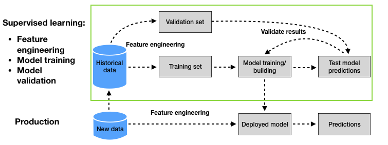

(Model_Validation_And_Selection)=
# Introduction

The purpose of a prediction model is to provide accurate predictions on *new* data, that is, on data that are not used for training the model. This is called the *generalization ability* of a prediction model. The predictive performance that can be expected from a prediction model on new data is referred to as the *generalization performance* or *test performance*, and is what should be maximized.  

The predictive performance of a prediction model on the training data, called *training performance*, is often a bad indicator of the generalization performance. Prediction models contain hyperparameters that allow them to fit more or less closely to the training data. Choosing hyperparameters that closely fit a model to the training data, for instance by increasing the expressiveness, usually results in a loss in terms of generalization performance, a phenomenon referred to as *overfitting*. This was for example observed in the Section {ref}`Baseline_FDS_Performances_Simulation`, with decision trees. A decision tree with unlimited depth was able to detect all frauds in the training set. It however had very poor fraud detection rates on the test set and a lower detection rate than a decision tree of depth two. 

The standard approach for assessing the generalization ability of a prediction model is a process known as *validation*. Validation consists in splitting the historical data into two sets. The first is used for training. The second, called *validation set*, is used to assess (validate) the generalization ability of the model. The diagram summarizing the validation methodology, as was presented in Chapter 2 - {ref}`ML_For_CCFD`, is reproduced in Fig. 1.    

Fig. 1. Machine learning for CCFD: Baseline methodology. The validation process (upper part, green box) relies on a validation set to estimate the generalization ability of different prediction models.   

The validation process allows estimating the generalization ability of different prediction models thanks to the validation set. The process can be used to compare the generalization ability with different model hyperparameters, model classes, or feature engineering techniques. The model that provides the best estimated generalization ability is eventually selected, and deployed for production. 

In credit card fraud detection, the purpose of a prediction model is more specifically to provide accurate predictions for transactions that will occur *in the future*. Due to the sequential nature of transaction data, special care must be taken when splitting the data into training and validation sets. In particular, the transactions of the validation set should occur *after* the transactions of the training set.  

This chapter explores the validation strategies that can be used for fraud detection problems. [Section 5.2](Validation_Strategies) first covers three types of validation strategies known as *hold-out*, *repeated hold-out*, and *prequential validation*. [Section 5.3](Model_Selection) then discusses model selection and optimization strategies that can be used to more efficiently explore the space of competing models. 

 